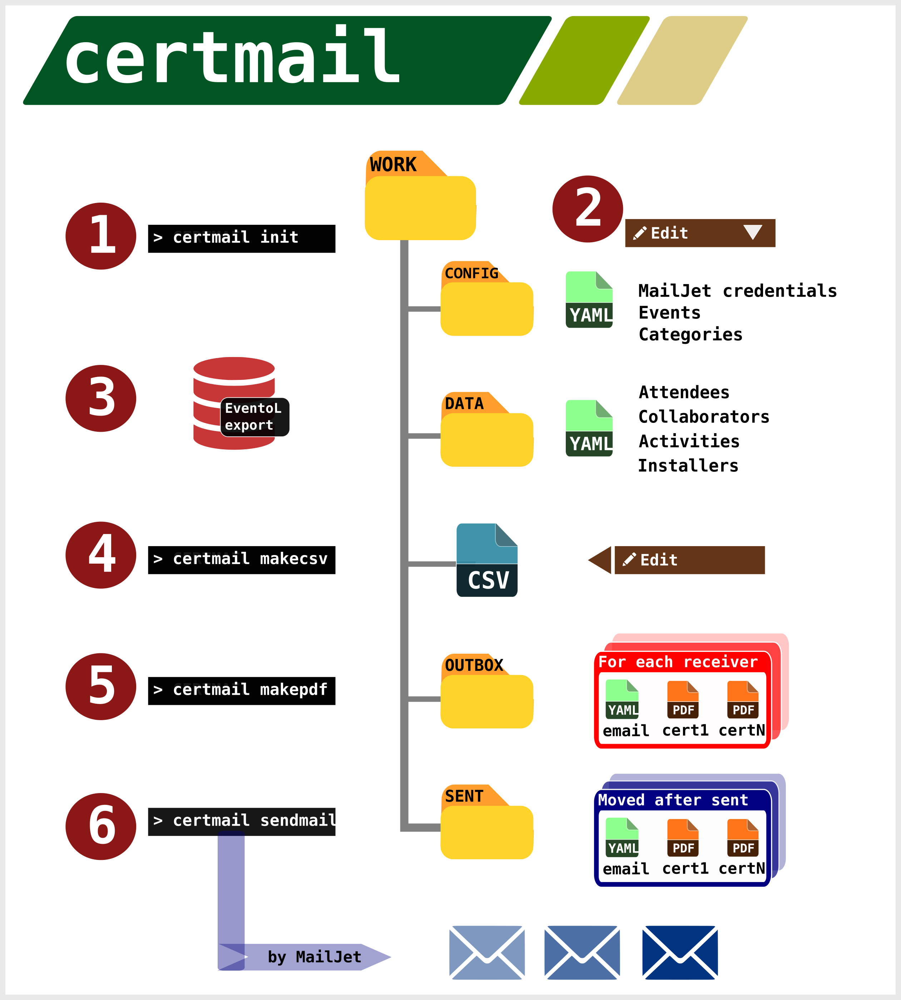

Certificates Mailer
-------------------

### **Automate** sending event's certificates by email.

Uses exported information from  **EventoL**,
generate **certificates in PDF**, and **mail them** to the corresponding
receiver.




Create an account in MailJet, to send SMTP.

Create a work directory:

> python -m certmail.py init

Edit config.yaml and add public and private key

Edit email.yaml and create the template of email

Edit certificate.svg and create the template of certificates

Go to the **EventoL** instance, login, and choose https://eventol.domain.com/admin

Select Activity, Attendees, Collaborators and Installers,
and export one by one to yaml format.

Put this files on «work/data» folder, created with init command

> python -m certmail.py makecsv

this will parse the yaml files exported from **EventoL**, and create a csv.

If you don't want that somebody receives an email, clear «send mail?» cell.

If you want to add some certificate, add **yes** to the corresponding cell.

And if you don't want to send a certificate, clear the corresponding cell.

> python -m certmail.py makepdf

This will create the certificates pdf to send, and yaml files with
all the info of every mail that will be sent.
All the information will be stored on the «work/outbox» directory.

> python -m certmail.py sendmails

This will send every mail. If an email is successfully sent, all it's data'll
move to «work/sent» folder, and a json with information of resulting
email will be stored.

## Requirements

- Python 3
- PyYaml
- mailjet-rest

## Dev Instructions
```
- git clone git@github.com:marian-vignau/certmailer.git
- virtualenv env
- source env/bin/activate
- pip install -r requirements.txt
- git clone https://github.com/facundobatista/certg.git
```

## Contributing

1. Fork it!
2. Create your feature branch: `git checkout -b my-new-feature`
3. Commit your changes: `git commit -am 'Add some feature'`
4. Push to the branch: `git push origin my-new-feature`
5. Submit a pull request :D

## TODO

* Testing
* Extend documentation
* Digital signature

## Credits

* María Andrea Vignau


